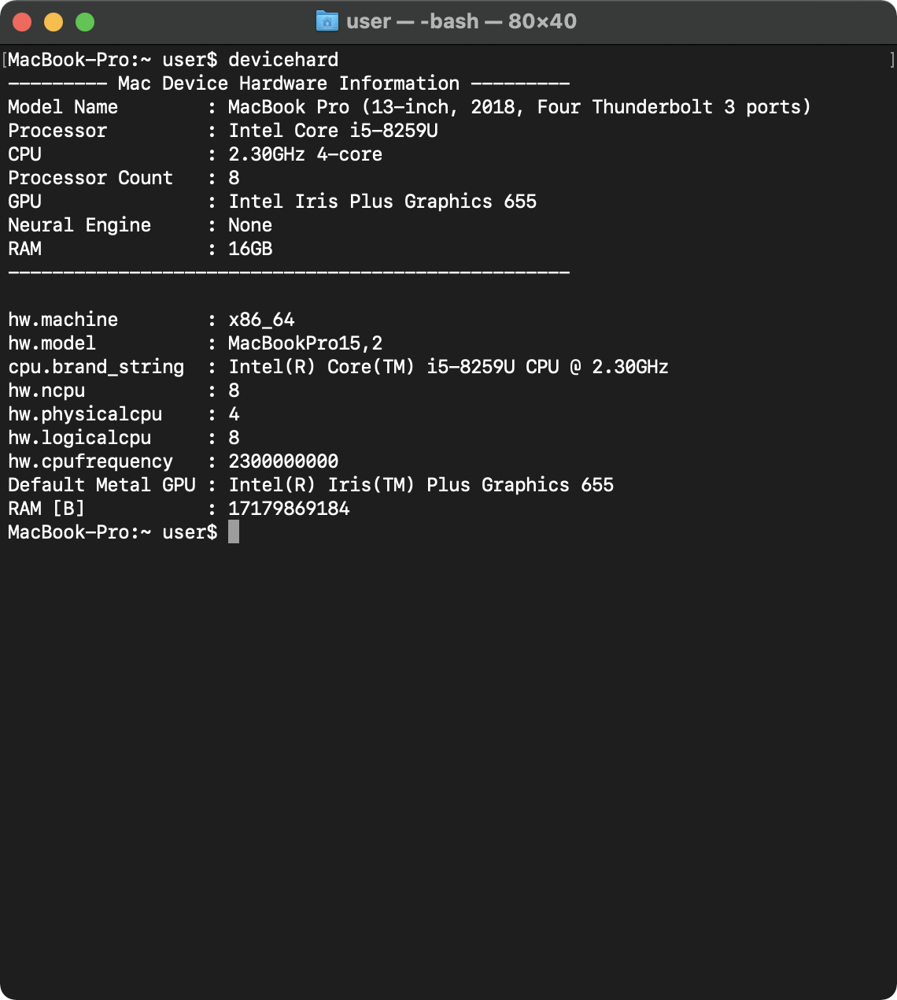

# devicehard
devicehard is a command-line tool to get hardware information of Mac devices.  This tool outputs the hardware information available in the package "[DeviceHardware](https://github.com/Shakshi3104/DeviceHardware)".

  

| Intel Mac (MacBook Pro 13-inch, 2018) | M1 Mac (MacBook Pro M1, 2020) |
| :----------------------: | :---------------------------: |
|  | Now Printing |

## Requirments
- macOS 11.1+
- Xcode 12.4+

## Swift Package Dependencies

- [DeviceHardware](https://github.com/Shakshi3104/DeviceHardware)

