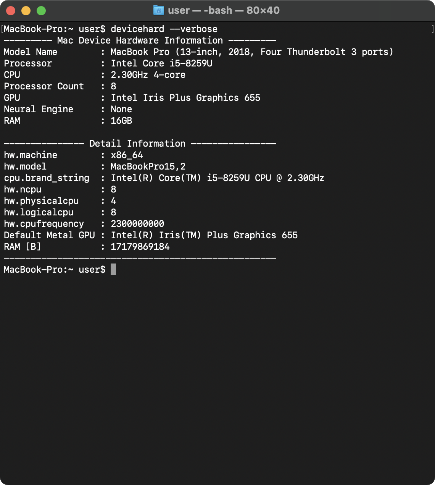
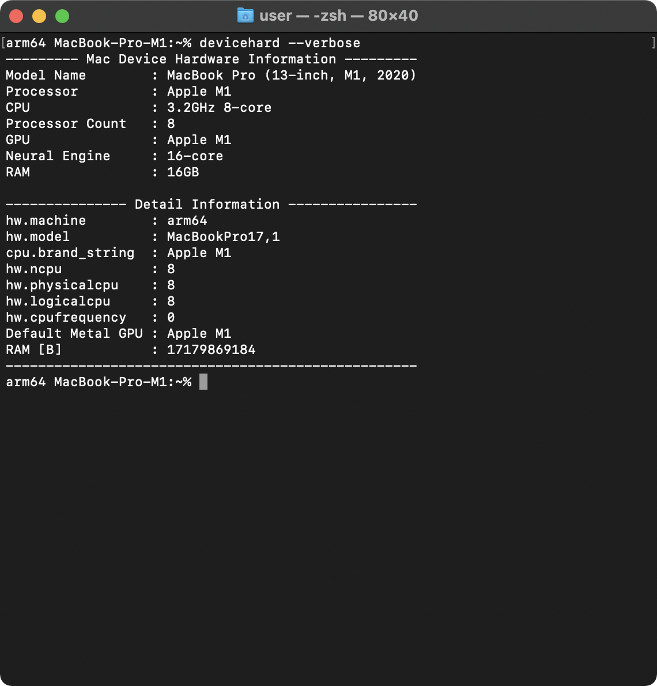

# devicehard
devicehard is a command-line tool to get hardware information of Mac devices.  This tool outputs the hardware information available in the package "[DeviceHardware](https://github.com/Shakshi3104/DeviceHardware)".

<p align="center">
  
</p>

| Intel Mac (MacBook Pro 13-inch, 2018) | M1 Mac (MacBook Pro M1, 2020) |
| :----------------------: | :---------------------------: |
|  |  |

## Usage
```
USAGE: devicehard [--verbose]

OPTIONS:
  --verbose               Show information not implemented in DeviceHardware. 
  --version               Show the version.
  -h, --help              Show help information.
```

## Installation

### Download binary file
1. Download the latest version - https://github.com/Shakshi3104/devicehard/releases
2. Open terminal app and move to the diectory contating the "devicehard" file
3. Add the executable permission to the file: `chmod +x devicehard`
4. Move the file to the /usr/local/bin directory: `mv devicehard /usr/local/bin`

### Complie via Xcode
1. Clone this repository
2. Open devicehard.xcodeproj
3. Modify "Signing & Capabilities" to use your own id
4. Build: `Command + B`

## Requirments
- macOS 11.1+
- Xcode 12.4+

## Swift Package Dependencies

- [Swift Argument Parser](https://github.com/apple/swift-argument-parser)
- [DeviceHardware](https://github.com/Shakshi3104/DeviceHardware)

